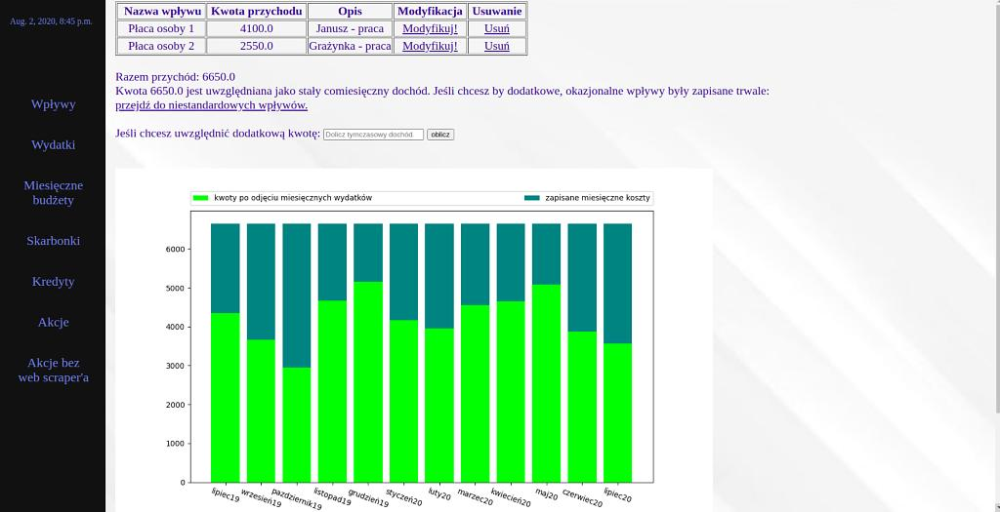
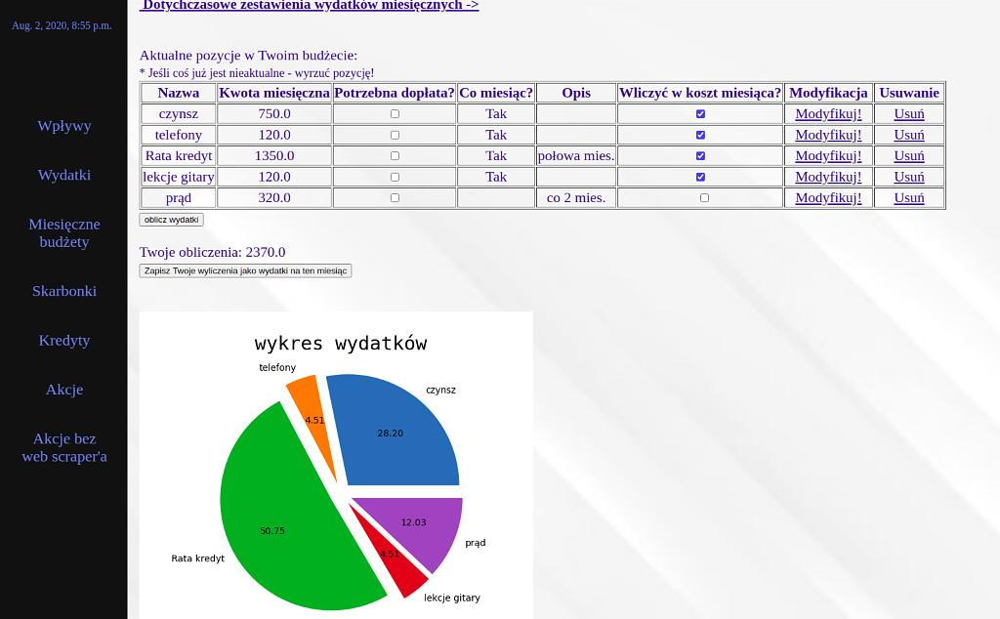
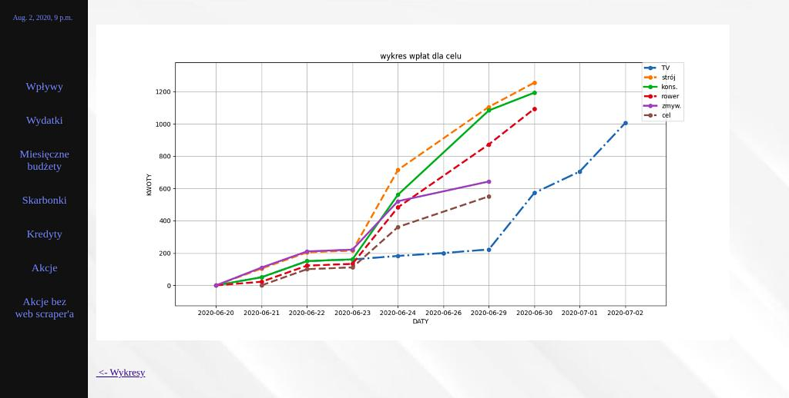

# Project budget

A complex budget enterprise for your own use.
Project contains managing earnings and spending, months budgets, 
possibility to create savings for many goals with managing deposits,
all for your finance-awareness and increasing motivation for saving!
You can also use credits overpayment system for quicker debt payoff
and even - if you need it - stock management.

Requirements: Python 3.10, Django 4.0.2, psycopg2-binary 2.9.3, 
BeautifulSoup 4.10.0, requests 2.27.1, matplotlib 3.5.1, PostgreSQL 14.2

**Correct configuration of the file 'settings_local.py' is essential for proper use!**

###### Screenshots:
---

---

---

---
